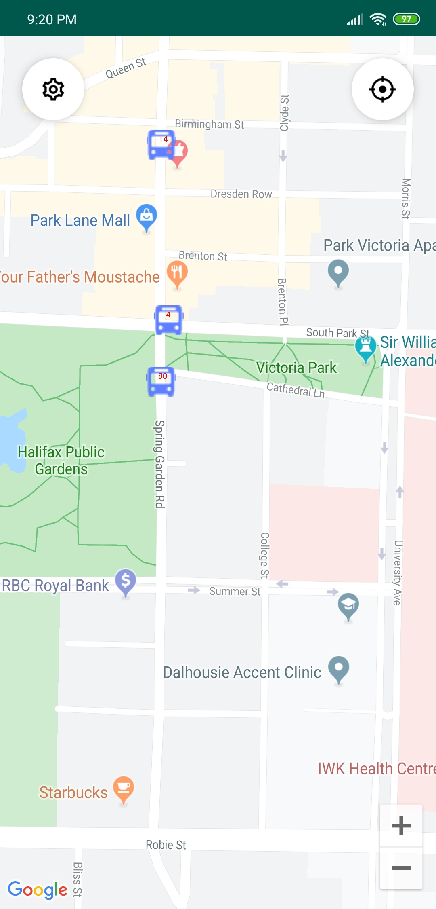

# Bus Tracker

This native Kotlin android app uses Halifax GTFS data parsed with `gtfs-realtime-bindings` library and display the realtime information on Google Maps. 

Due to time constrains some anticipated functionalities are not fully implemented see the functions section below for more details. Also, I decide not to create a custom icon for the app this time. Although it is a better practice to put values in XML, I found it unnecessary in this case so hard coded values are used instead.  

In case the route numbers are hard to see or blocked by other icons on the map, click on the individual bus will display the route in a larger font as title. 

## Functions

The main functionality is to display the locations of the buses in Halifax, detailed descriptions of all planned functionalities are shown below. Unchecked items are not implemented due to leak of time.

- [x] The user to center the map at their current location with a click 
- [x] Buses are marked with a route number
- [x] The user can zoom and pan the map freely
- [x] The last state of the map are saved and displayed when the app is resumed
- [x] Bus locations are shown on launch
- [x] Bus locations are updated every 15 seconds
- [x] The app will center the default location of downtown Halifax with a zoom level of 14.0 if no last camera location was saved
- [ ] The user can enable the map to follow his/her movement in the settings
- [ ] The user can filter what routes to display in the settings
- [ ] Shows when will the next update occur

## Screenshot

## References

Icons used in the application are from icons8, details about individual icons can be found below.

| ic_bus.png                                  | ic_location.png                              | ic_settings.png                                   |
| ------------------------------------------- | -------------------------------------------- | ------------------------------------------------- |
| [Link](https://icons8.com/web-app/9351/bus) | [Link](https://icons8.com/web-app/8209/hunt) | [Link](https://icons8.com/web-app/82535/settings) |

2 posts are referenced to display the number in the custom marker

[Post 1](https://stackoverflow.com/questions/24716987/using-an-xml-layout-for-a-google-map-marker-for-android)| [Post 2](https://stackoverflow.com/questions/15001455/saving-canvas-to-bitmap-on-android)

